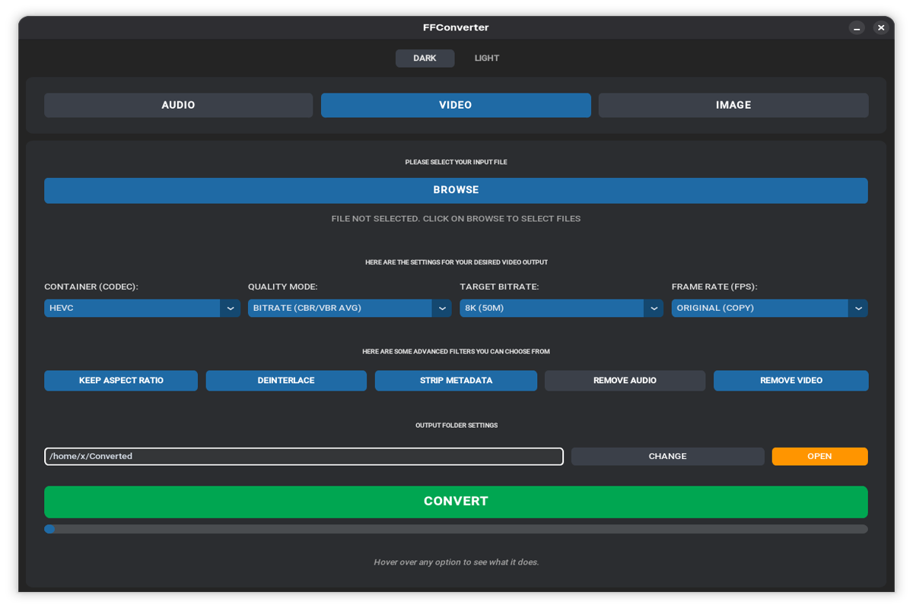
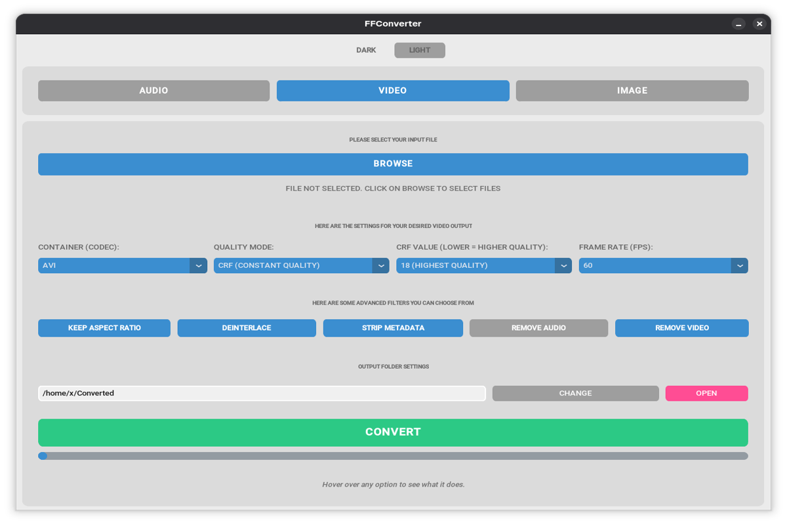

# FFConverter


A simple, portable video, audio, and image converter for Linux.

## - How to download ?

Download your desired version from [Releases](https://github.com/963arc/FFconverter/releases/tag/v1.0).

## Install (DEB) - Debian / Ubuntu

Install dependencies:

```bash
sudo apt install ffmpeg python3 python3-tk python3-pip
pip3 install --break-system-packages customtkinter send2trash tkinterdnd2
```

Download and install package:

```bash
curl -LO https://github.com/963arc/FFconverter/releases/download/v1.0/FFConverter_1.0-1_amd64.deb
sudo dpkg -i FFConverter_1.0-1_amd64.deb
```

**Troubleshooting:** If the app fails to launch with "ModuleNotFoundError", install the Python packages:

```bash
pip3 install --break-system-packages customtkinter send2trash tkinterdnd2
```

Run: Type `FFConverter` in terminal, or launch from application menu.

---

## Install (RPM) - Fedora / RHEL

> **Note:** FFmpeg is optional - the app includes a bundled fallback.
> If you don't have FFmpeg installed, the app will still work using its built-in version.

Download and install package:

```bash
curl -LO https://github.com/963arc/FFconverter/releases/download/v1.0/FFConverter-1.0-1.x86_64.rpm
sudo dnf install FFConverter-1.0-1.x86_64.rpm
```

**Troubleshooting:** If you get an error about FFmpeg conflicts (common on Fedora with rpmfusion), use:

```bash
sudo dnf install --allowerasing FFConverter-1.0-1.x86_64.rpm
```

Or install without dependencies and use bundled FFmpeg:

```bash
sudo rpm -ivh --nodeps FFConverter-1.0-1.x86_64.rpm
```

Run: Type `FFConverter` in terminal, or launch from application menu.

---

## Install (Arch Linux) - Manual

Install dependencies:

```bash
sudo pacman -S ffmpeg python
```

Download and copy files:

```bash
curl -LO https://github.com/963arc/FFconverter/releases/download/v1.0/FFConverter-1.0-1-x86_64.tar.gz
tar -xf FFConverter-1.0-1-x86_64.tar.gz
cd FFConverter-1.0-1-x86_64
sudo cp -r usr /
```

Run: Type `FFConverter` in terminal, or launch from application menu.

---

## Install (AppImage)

```bash
curl -LO https://github.com/963arc/FFconverter/releases/download/v1.0/FFConverter.AppImage
chmod +x FFConverter.AppImage
./FFConverter.AppImage
```

---

## Install (Portable .tar.xz)

```bash
curl -LO https://github.com/963arc/FFconverter/releases/download/v1.0/FFConverter-portable.tar.xz
tar -xf FFConverter-portable.tar.xz
cd FFConverter
chmod +x run.sh
./run.sh
```

---

## Install (Flatpak)

```bash
curl -LO https://github.com/963arc/FFconverter/releases/download/v1.0/FFConverter.flatpak
flatpak install --user FFConverter.flatpak
flatpak run com.ffconverter.FFConverter
```

---

## Install (ARM64) - Raspberry Pi / ARM Linux

For ARM64 devices (Raspberry Pi 4/5, ARM servers):

```bash
curl -LO https://github.com/963arc/FFconverter/releases/download/v1.0/FFConverter-portable-arm64.tar.xz
tar -xf FFConverter-portable-arm64.tar.xz
cd FFConverter-portable-arm64
chmod +x run.sh
./run.sh
```

---

## Screenshots

### Dark Theme


### Light Theme


---

## Desktop Integration (Optional)

To add FFConverter to your application menu (for portable version):

```bash
# Copy desktop file
cp usr/share/applications/ffconverter.desktop ~/.local/share/applications/

# Copy icon
mkdir -p ~/.local/share/icons/hicolor/256x256/apps/
cp usr/share/icons/hicolor/256x256/ffconverter.png ~/.local/share/icons/hicolor/256x256/apps/
```

Log out and log back in, or restart your desktop environment for the menu to update.

---

## Requirements

- **Platform:** Linux only (not Windows or macOS)
- **Python 3.8 or higher**
- **FFmpeg is optional** - the app checks your system first, then uses the bundled version if not found

---

## Troubleshooting

### "Permission denied" when running
```bash
chmod +x run.sh
```

### "Python not found" error
Install Python 3:

- **Ubuntu/Debian**: `sudo apt install python3`
- **Fedora**: `sudo dnf install python3`
- **Arch Linux**: `sudo pacman -S python`

### App won't start (Portable version)
Make sure you're in the FFConverter folder and run:
```bash
./run.sh
```

### File too large warning when extracting
The archive is ~90MB compressed (~388MB uncompressed). Ensure you have enough disk space.

---

## What's Included (Portable .tar.xz)

| Component | Description |
|-----------|-------------|
| ffc.py | Main application |
| run.sh | Launcher script (hybrid: system FFmpeg → bundled) |
| usr/bin/ffmpeg | Bundled FFmpeg (fallback, 194MB) |
| usr/bin/ffprobe | Bundled FFprobe (fallback) |
| usr/share/applications/ffconverter.desktop | Desktop menu entry |
| usr/share/icons/.../ffconverter.png | App icon (256x256) |

The app automatically uses system FFmpeg if available, otherwise falls back to the bundled version.

---

## Uninstall

**Portable version:**
```bash
rm -rf FFConverter
```

**DEB/RPM:**
```bash
# Debian/Ubuntu
sudo apt remove ffconverter

# Fedora/RHEL
sudo dnf remove FFConverter
```

**Arch:**
```bash
sudo rm -rf /opt/FFConverter
sudo rm /usr/bin/FFConverter
```

To remove desktop integration:

```bash
rm ~/.local/share/applications/ffconverter.desktop
rm ~/.local/share/icons/hicolor/256x256/apps/ffconverter.png
```

---

## Support

For issues or questions, open an issue on the project GitHub page.

## Support the Project

If this project saved you time, consider sending a tip! 

| Asset | Network | Wallet Address |
| :--- | :--- | :--- |
| **Bitcoin** | BTC | `bc1q6ayz2jjzzvxauhj24vjjaj6ljsp86lna7ny9p6` |
| **Ethereum** | ETH / ERC-20 | `0x7958b8eC663f6062F1F5943aD87b2e8C8f945233` |
| **Solana** | SOL | `7XpptWv6db53GYiHXioUnr9phHV5tB7zo5z9wvLynFGC` |
| **Monero** | XMR | `8BL7SNroN7XGqxS8CmgBQyPB7UPSZ2uKtRSHmSk815GNh56oKFpmdWh2Ko2Pe4XsjM3oChNpkh5bxVzgSvvgaPBNGR7TJ4d` |
| **Litecoin** | LTC | `LdKdCyq7SEhELJa7kvH9Unu8dTnn3Dm9i8` |

> *Note: The Ethereum address supports ETH, USDT, USDC, Polygon, and BNB Chain.*

---

## License

This program is free software: you can redistribute it and/or modify it under the terms of the GNU General Public License as published by the Free Software Foundation, either version 3 of the License, or (at your option) any later version.

This program is distributed in the hope that it will be useful, but WITHOUT ANY WARRANTY; without even the implied warranty of MERCHANTABILITY or FITNESS FOR A PARTICULAR PURPOSE. See the GNU General Public License for more details.

You should have received a copy of the GNU General Public License along with this program. If not, see <https://www.gnu.org/licenses/>.

**Note:** The FFmpeg binaries bundled with this application (in `usr/bin/`) are licensed separately under LGPL. See the included FFmpeg LICENSE file for details.

---

Enjoy converting your files!
